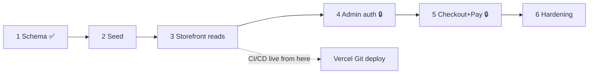

# Drip Nation — Backend Build Plan (phase by phase)

Companion to [`system-architecture.md`](./system-architecture.md). This is the
execution order. Each phase is **independently shippable and reversible**, has an
explicit **gate** (the observable condition that proves it's done), and a
**rollback**. High-risk phases (auth, checkout, payments) stop for review before
merge per the engineering contract.

Legend: ✅ done · 🔨 next · ⬜ pending · 🔒 high-risk (requires review)

---

## Phase 0 — Foundations ✅ DONE

- Repo, Vercel link, `.gitignore` (`.env*`, `.vercel`, `node_modules`).
- Architecture + trust-boundary ADR written.
- **Gate:** repo builds & serves the static prototype. ✅

## Phase 1 — Schema ✅ DONE

- Applied `supabase/migrations/0001_init.sql` to project `ukqcptrbsmdreelgdovl`.
- 5 tables, RLS on all, `is_admin()` + `decrement_stock()` + trigger, migration
  history recorded (`schema_migrations` = `0001`).
- Hardened `search_path` on both functions (advisor warnings cleared).
- **Gate (verified):** anon reads Active products; anon reads zero orders. ✅
- **Rollback:** `drop schema public cascade` + re-run baseline (dev only).

---

## Phase 2 — Seed the real catalog ⬜

The current per-visitor catalog is `Math.random()` junk (`store-bridge.js`
`ensureDefaults()`), so there is nothing worth migrating — we **decide and seed
the real products once**. Field mapping + seed mechanics:
[`../backend-migration-plan.md`](../backend-migration-plan.md).

- Pick the real products (names, prices, stock, sizes, images).
- Write a one-off `supabase/seed.sql` (or ~30-line script): resolve category
  name → `category_id`, split `"S, M, L, XL"` → `text[]`, `sale '' → null`,
  drop `.html` from slugs.
- Insert categories first, then products (FK order).
- **Gate:** every product has a valid `category_id`, a non-random price, real
  stock; `select count(*)` matches the intended catalog.
- **Rollback:** `truncate products, categories restart identity cascade`.
- **Risk:** low. Data only.

## Phase 3 — Storefront reads from Supabase ⬜

Swap the data source behind `store-bridge.js` (the storefront reads
`assets/js/store-bridge.js` — `js/` is dead, delete it).

- Add `@supabase/supabase-js` via CDN `<script>` (no bundler; keep it vanilla).
- Create `assets/js/supabase-client.js` — init with project URL + **anon** key.
- Rewrite `StoreBridge` getters to async Supabase queries (shapes already match):
  - `getProducts()` → `.from('products').select('*, categories(name)').eq('status','Active')`
  - `getProductsByCategory(slug)` → filter on joined category
  - `getProductById(id)` → `.eq('id', id).single()`
- Delete `ensureDefaults()` (DB is the source of truth now).
- Keep `validatePromo()` client-side **for UX only** — re-validated server-side in Phase 5.
- **Cleanup:** delete the drifted `js/` directory; keep `assets/js/` only.
- Add loading / empty / error states (per frontend rules).
- **Gate:** two different browsers (or an incognito window) see the *identical*
  catalog. Network tab shows Supabase reads, no localStorage seeding.
- **Rollback:** feature-flag the old localStorage path; a bad deploy falls back
  instead of breaking the store. Remove the flag once the gate holds.
- **Risk:** medium (visible frontend change — verify responsive + reduced-motion).

## Phase 4 — Admin auth + writes 🔒 ⬜

- Enable Supabase Auth (email/password). Create **one** admin user.
- Grant the admin claim: `user_role = 'admin'` via an **Auth Hook** (custom
  access token hook) — matches the `is_admin()` check already in RLS.
- Put a login screen in front of `admin.html`; unauthenticated → redirect.
- Rewrite admin `get`/`set` to Supabase `select`/`insert`/`update`/`delete`
  using the authenticated session.
- **Gate:**
  - Logged-out user hitting `/admin.html` sees login, not the panel.
  - A non-admin authenticated user is rejected by RLS on write (test explicitly).
  - A catalog edit in admin appears on the storefront for everyone.
- **Rollback:** admin panel is additive; revert to read-only if auth misbehaves.
- **Risk:** high — **stop for security review before merge.** Verify the JWT
  claim is actually present and RLS rejects forged/absent claims.

## Phase 5 — Checkout + orders + payment 🔒 ⬜

The core commerce phase. Split into reviewable sub-steps. **Detailed design draft:**
[`phase-5-checkout-payments.md`](./phase-5-checkout-payments.md).

### 5a — Close the schema hardening debt
- ✅ **Done (migration `0002`)** — dropped the `with check (true)` anon INSERT
  policies on `orders`/`order_items`. Tables are now fail-closed; only the
  service-role Edge Function (which bypasses RLS) writes authoritative orders.
  Verified: anon `POST /orders` → `42501 row violates RLS`.
- ⬜ **Migration `0006` (ships with the Edge Function):** make stock decrement
  oversell-safe — atomic conditional update / `FOR UPDATE` inside the checkout
  transaction, replacing `greatest(0, stock - qty)`.
- ⬜ **Migration `0006`:** atomic promo usage —
  `update promos set used = used + 1 where code = $1 and (max_uses = 0 or used < max_uses)`.
- **Gate:** anon INSERT into `orders` rejected (done); concurrent checkout test
  does not oversell (pending `0003`).

### 5b — `checkout` Edge Function (Deno)
- Input: `{ items:[{product_id,size,quantity}], promo_code?, customer{name,email,phone,address} }`.
- Server: fetch current prices/stock/promo, **recompute** subtotal/discount/
  shipping/total, validate availability, INSERT order (`Pending`) + order_items
  snapshots, create Razorpay order, return `{order_id, razorpay_order_id, amount, key_id}`.
- **Never** trust client-sent prices/totals.
- **Gate (failure paths, not just happy):** invalid product, unavailable product,
  quantity > stock, invalid promo, expired promo, exhausted promo — each returns a
  clean error and creates no order.

### 5c — Razorpay client checkout
- Replace the "Coming Soon" modal with a real checkout form (name, email, phone,
  address), then open Razorpay with the server-provided order.

### 5d — `razorpay-webhook` Edge Function
- Verify `X-Razorpay-Signature` (HMAC, reject if invalid).
- Idempotent: mark order `Paid` only if not already; duplicate/replayed webhook is
  a no-op. Stock decrement fires via trigger. Log every event.
- **Gate (failure paths):** forged signature rejected; duplicate webhook does not
  double-decrement; unmatched order handled; payment-failed leaves order `Pending`/`Failed`.

### 5e — Confirmation email (Resend)
- On `Paid`, send order confirmation. Non-blocking (email failure ≠ payment failure).

- **Overall gate:** a test purchase writes one `orders` row + its `order_items`,
  decrements stock exactly once, and shows in the admin orders table.
- **Rollback:** checkout is behind the new form; keep the "Coming Soon" modal as a
  kill-switch until the gate passes in production.
- **Risk:** high — **architect → implement → tests → security review → code review.**

## Phase 6 — Production hardening 🟡 IN PROGRESS

- ⬜ **Move product media to Supabase Storage** — *deferred, low value here*: media is
  already CDN-delivered by Vercel (static hosting), so the CDN goal is met; a real
  migration also needs the service-role key. Revisit when admin image uploads land.
- ✅ **Server-side promo validation** is the sole source of truth (Phase 5 `checkout` fn
  + atomic `redeem_promo`).
- ✅ **Advisors clean** (security + performance) — only expected INFOs (service-role-only
  `payment_events`/`checkout_attempts`, unused indexes awaiting queries) + the
  platform/trigger `security_definer` lints.
- ✅ **Rate limiting / abuse protection** on checkout — migration `0007` (`rate_ok`,
  per-IP 8 / 10 min; service-role only). Verified.
- 🟡 **Observability** — structured logs added to both functions; **webhook-failure
  alerting** still ⬜ (needs an external monitor once the functions are deployed).
- 🟡 **Gate — load/abuse test:** rate-limit abuse test ✅ **passed live** (checkout
  throttles to `429` at 8 / 10 min); full payment load test still needs Razorpay keys.
- **Risk:** medium.

---

## Cross-cutting: CI/CD

- **Native Vercel Git integration** (no GitHub Actions token — that approach
  failed 3× earlier on auth). Push to `main` → Vercel builds & deploys; PRs get
  preview URLs automatically.
- Supabase migrations are applied via the Management API / MCP, **not** through the
  Vercel build. Frontend deploy and DB migration are separate, independently
  reversible steps.

## Sequencing summary

Do not attempt every phase at once. Correctness and security over feature count.
Ship Phase 2 → 3 to get a real, shared catalog live and deploying; then gate 4 and
5 behind review.
