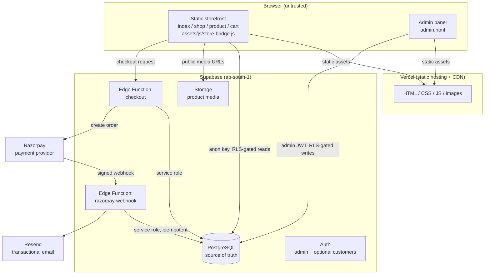
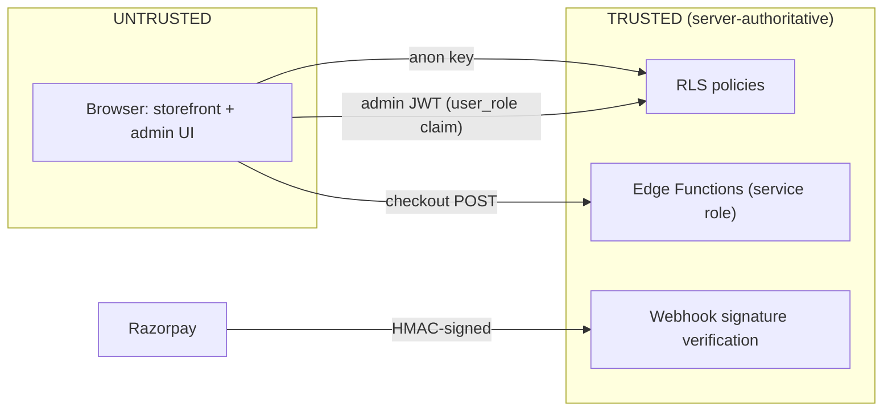
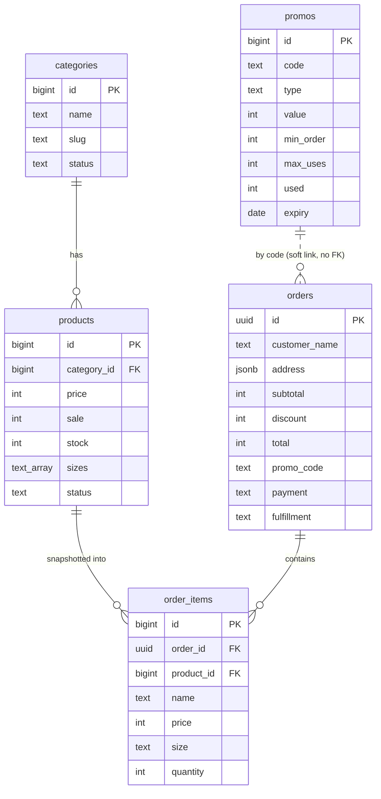
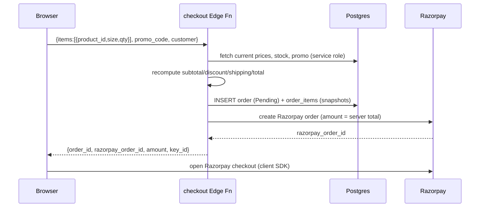
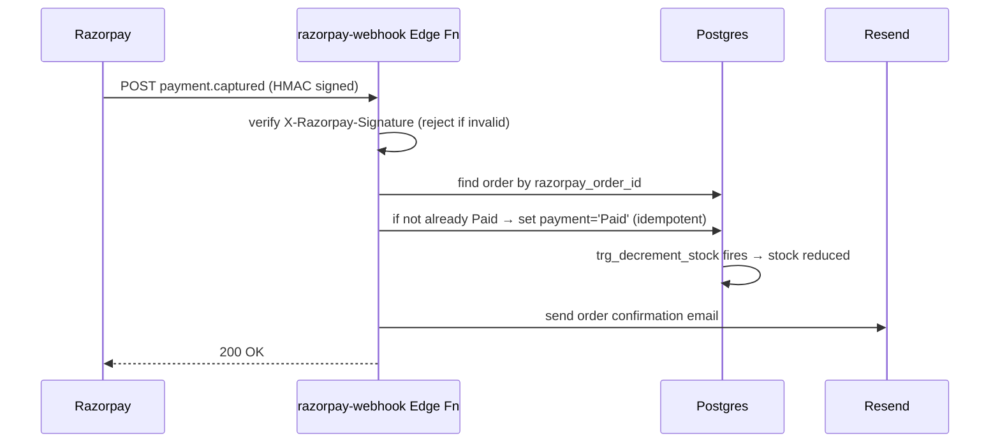

# Drip Nation — Backend System Architecture

Status: **Accepted** · Supersedes nothing · Extends `docs/decisions/0001-commerce-trust-boundary.md`

This document describes the target production backend for Drip Nation. It is the
"what and why" of the system; the "in what order" lives in
[`backend-plan.md`](./backend-plan.md).

---

## 1. Guiding principles

1. **The browser is untrusted.** Price, inventory, discount, order total, payment
   state, and admin authorization are all decided server-side. (ADR-0001.)
2. **Keep the frontend.** Drip Nation is a static, vanilla HTML/CSS/JS editorial
   storefront. We do **not** migrate to React/Next. We swap the *data source*
   behind `store-bridge.js` from localStorage to Supabase, nothing more.
3. **Boring, reversible, incremental.** Every phase ships on its own and can be
   rolled back. No big-bang rewrite.
4. **One managed platform per concern.** Supabase for data/auth/storage/functions,
   Razorpay for payments, Resend for email, Vercel for static hosting + CI/CD.
   No self-hosted infrastructure.

---

## 2. Component map



### Responsibilities

| Component | Owns | Trust |
|---|---|---|
| Static storefront | Presentation, cart UX, calling checkout | Untrusted |
| Admin panel | Catalog editing UI | Untrusted UI; authority is the admin JWT + RLS |
| PostgreSQL | Products, categories, promos, orders, inventory | **Source of truth** |
| Supabase Auth | Identity, admin claim, optional customer accounts | Trusted |
| Supabase Storage | Product images/media | Trusted (public-read bucket) |
| `checkout` Edge Function | Recompute totals, validate stock/promo, create order + Razorpay order | **Trusted boundary** |
| `razorpay-webhook` Edge Function | Verify signature, mark paid (idempotent), trigger fulfillment | **Trusted boundary** |
| Razorpay | Authoritative payment confirmation | Trusted (signature-verified) |
| Resend | Order confirmation email | Trusted |
| Vercel | Static hosting, CDN, Git-driven CI/CD | Trusted (build only) |

---

## 3. Trust boundaries



- **Anon key** (publishable) ships to the browser. Safe: RLS decides every row.
- **Service-role key** exists only inside Edge Function secrets. Never in the
  browser, repo, or logs.
- **Admin authority** = a `user_role = 'admin'` claim on the JWT, checked by the
  `is_admin()` SQL function inside RLS. Hiding the admin button is UX, not security.
- **Payment authority** = a signature-verified Razorpay webhook. A browser saying
  "payment succeeded" is never trusted.

---

## 4. Data model (applied — migration `0001_init.sql`)



Key decisions already baked in:

- **Money = integer whole rupees** (matches existing JS; no paise anywhere).
- **`order_items` are immutable snapshots** (name + price captured at purchase;
  later product edits never rewrite order history).
- **Stock decrements server-side** via the `trg_decrement_stock` trigger when an
  order transitions to `payment = 'Paid'`.
- **RLS enabled on all five tables.** Anon reads Active catalog only; anon sees no
  orders; admin (JWT claim) has full access.

### Known hardening debt (tracked, must close before public checkout)

| Item | Current | Target |
|---|---|---|
| `orders`/`order_items` INSERT | `with check (true)` — anon can insert arbitrary orders | Route all order creation through the `checkout` Edge Function; restrict/remove direct anon INSERT |
| Stock decrement | `greatest(0, stock - qty)` — not oversell-safe under concurrency | `SELECT … FOR UPDATE` / atomic conditional update inside the function's transaction |
| Promo usage | Client counter today | Atomic `update … set used = used + 1 where used < max_uses` server-side |

---

## 5. Core data flows

### 5.1 Catalog read (storefront)

```
Browser (anon key)
  → supabase.from('products').select('*, categories(name)').eq('status','Active')
  → RLS lets Active rows through
  → render
```

No secrets, no server round-trip beyond Supabase's Data API. Cacheable.

### 5.2 Checkout (server-authoritative)



The browser sends *intent* (product ids, sizes, quantities, promo code, contact
details). It never sends prices or totals. The function is the only writer of
authoritative orders.

### 5.3 Payment confirmation (webhook)



Idempotency: a duplicate/replayed webhook finds the order already `Paid` and is a
no-op. Signature verification rejects forged callbacks.

### 5.4 Admin write

```
Admin logs in (Supabase Auth) → JWT carries user_role='admin'
  → admin.html uses supabase-js with that session
  → INSERT/UPDATE/DELETE on catalog
  → RLS is_admin() allows it; anon/customer JWTs are rejected
```

---

## 6. Technology choices & rationale

| Concern | Choice | Why | Rejected alternative |
|---|---|---|---|
| Hosting | Vercel static + Git CI/CD | Already linked; native Git deploy = zero-token CI/CD | GitHub Actions + Vercel token (failed 3× on auth earlier) |
| Data/Auth/Storage/Functions | Supabase (ap-south-1) | One platform, Postgres + RLS + Deno functions; region near customers | Self-hosted Postgres + custom API |
| Payments | Razorpay | ₹/India-native, UPI, webhook + signature model | Stripe (weaker India/UPI story) |
| Email | Resend | Simple transactional API, works from Deno Edge Functions | Supabase SMTP (fine as fallback) |
| Frontend | Keep vanilla HTML/JS | Preserve editorial identity; smallest change | React/Next rewrite (unjustified) |

---

## 7. Environments & secrets

| Secret | Lives in | Never in |
|---|---|---|
| Supabase anon/publishable key | Browser JS (safe by design) | — |
| Supabase service-role key | Edge Function secrets | Browser, repo, logs |
| Razorpay `key_id` | Browser (public) + function | — |
| Razorpay `key_secret` | Edge Function secrets | Browser, repo, logs |
| Razorpay webhook secret | `razorpay-webhook` function secret | Browser, repo, logs |
| Resend API key | Edge Function secrets | Browser, repo, logs |

`.env.local` is gitignored (`.env*`) and holds only the auto-generated Vercel OIDC
token — no long-lived secrets in the repo.

---

## 8. What this architecture explicitly does NOT do (yet)

- No customer accounts at launch — **guest checkout** only. Orders carry contact
  details; account linkage is a later, additive phase.
- No inventory *reservation* (hold-on-add-to-cart). Stock is checked at checkout
  and decremented on payment. Acceptable at current catalog scale.
- No multi-currency. Integer rupees only.
- No search service, no CMS, no recommendations. Out of scope.
